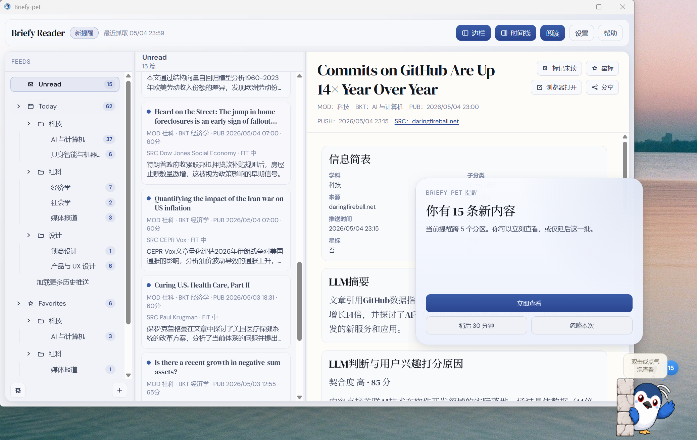
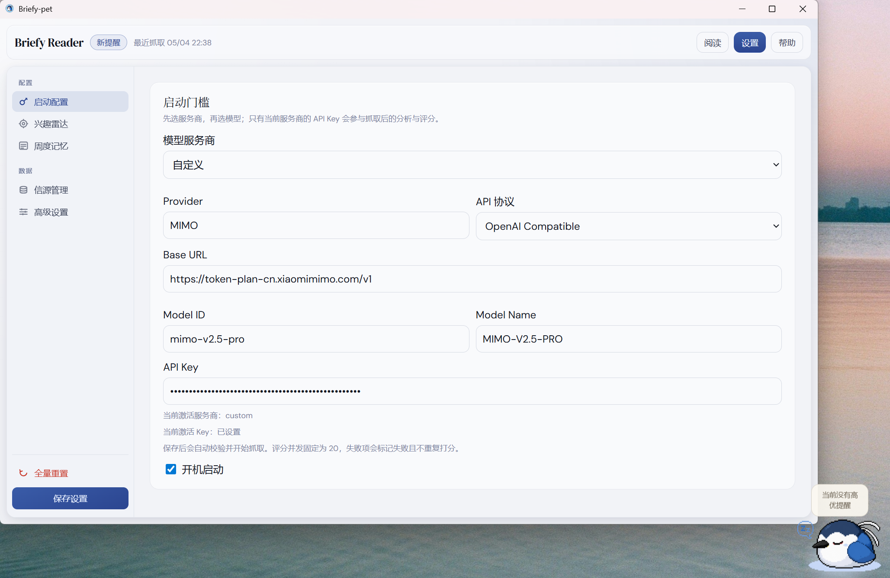

# BriefyPet

<p align="center">
  
</p>

<p align="center">
  <strong>静默守护你的桌面阅读助手</strong>
</p>

<p align="center">
  <a href="https://opensource.org/licenses/MIT"></a>
  
  
</p>

## 什么是 BriefyPet

> 信息过载深感焦虑？
>
> 程源码部署复杂？
>
> 订阅信息滞留在邮箱和阅读器中懒得打开？

作为 AI Native 的一代大学生，我们深切体会到信息洪流下的极度兴奋和焦虑感；然而，我们总是辗转于二手中文信息平台，消费着被翻译乃至曲解的滞后转载信息；而一手优质信源由于语言、平台习惯等种种限制，难以快速获取和理解沉淀。

现有的阅读器和信息订阅网站始终没有解决的是：

1. 如何提高信息可达性，而非让信息滞留在专业软件和邮箱内
2. 如何个性化定制用户需求，而不是让关注兴趣各异的用户收看相同推荐
3. 如何尽可能降低非专业用户的使用门槛，避免复杂源码部署配置流程
4. 如何形成长期记忆，便于用户进行知识沉淀以及介入兴趣校准

BriefyPet，一个智能桌面阅读助手，正致力于从信源、个性化、记忆和可达性等全方位介入解决上述问题。

它不是传统意义上的 RSS 阅读器，而是一个集收集、筛选与提醒于一体的智能桌面助手：先把控一手信源入口质量，再按用户兴趣偏好做摘要、契合度判断和推荐理由，最后只在真正值得优先阅读的内容出现时提醒你。

## 运行效果

### 阅读页



### 设置页




## 功能

- 可直接安装和运行的本地桌面应用，无需账号注册和源码安装；
- 信息订阅通过 RSS 机制获取，无需爬虫和复杂 API 请求；
- 桌宠仅在任务执行与提醒时出现，兼顾趣味性和低打扰、高可达性；
- 个性化定制兴趣点，随使用过程持续校准；
- LLM 自动生成中文摘要、契合度评分和推荐理由；
- 支持文章阅读、原文打开、收藏、笔记、未读和历史记录；
- 支持主流 LLM Provider 和自定义配置导入；
- 数据本地保存，不依赖云端账号。

## 快速开始

访问 [Release](https://github.com/DonkeyKing01/BriefyPet/releases) 或 [产品发布页](https://briefypet.netlify.app/) 下载安装包。首次启动后需要：

1. 选择 LLM Provider；
2. 填入对应供应商的 API Key；
3. 选择关注模块与二级分类；
4. 写下你的兴趣偏好。

配置完成后，BriefyPet 会开始抓取 RSS、调用 LLM 摘要评分，并在高价值内容出现时提醒。

常用 API Key 入口：

- [OpenAI API Key](https://platform.openai.com/api-keys)
- [Anthropic API Key](https://console.anthropic.com/settings/keys)
- [Gemini API Key](https://aistudio.google.com/app/apikey)
- [DeepSeek API Key](https://platform.deepseek.com/api_keys)
- [Qwen API Key](https://help.aliyun.com/zh/dashscope/opening-service)
- [MiniMax API Key](https://platform.minimax.io/docs/guides/quickstart)
- [GLM API Key](https://docs.bigmodel.cn/)
- [Kimi API Key](https://platform.moonshot.ai/console/api-keys)


## 信源

当前信源目录位于 `src-tauri/resources/rss-catalog.opml`，覆盖 6 个一级大类领域、24 个二级下属学科、47 个细分分类，总计 760+ 条订阅入口。重点关注科技、医学、基础科学、社会科学、设计和商业中的高质量来源。

| 一级领域 | 示例二级分类 | 典型来源 |
| --- | --- | --- |
| 科技与 AI | AI 与计算机、具身智能与机器人、HCI 研究 | 官方账号、研究团队、工程博客和高密度创作者观点 |
| 社会科学 | 经济学、社会学、政治学 | 经济学、社会学、政治学前沿，以及严肃评论来源 |
| 医学 | 临床医学、公共卫生、药物研发、生物医学工程 | 临床、公共卫生、生物工程和药物研发信号 |
| 基础科学 | 生物、物理、化学与材料、环境科学、数学 | 物理、化学、生物与交叉前沿来源 |
| 设计 | 产品与 UX、工程设计、创意设计、设计方法 | 产品与 UX 设计、HCI 研究和工程设计 |
| 商业 | 媒体报道、行业观察、长期观点 | 商业媒体、行业观察和长期观点来源 |

用户也可以在设置页新增自定义 RSS 源。新增信源会被归入对应模块与分类，并进入后续抓取、摘要和评分流程。

## IP 形象

我们选用有着中华田园企鹅之称的夜鹭夜师傅作为我们的桌宠形象，它是安静、机敏又睿智的，默默筛选高价值信息，守护用户宝贵的注意力。

期待你在使用过程中触发夜鹭的以下状态：

| 状态 | 含义 | 预览 |
| --- | --- | --- |
| loading | 应用启动或加载中 | <br>`public/pets/briefy-ip/gifs/loading.gif` |
| needs-config | 尚未完成必要配置 | <br>`public/pets/briefy-ip/gifs/needs-config.gif` |
| polling | 定时轮询信源 | <br>`public/pets/briefy-ip/gifs/polling.gif` |
| scanning | 正在抓取、摘要和筛选 | <br>`public/pets/briefy-ip/gifs/scanning.gif` |
| idle | 当前无高优先级提醒 | <br>`public/pets/briefy-ip/gifs/idle.gif` |
| new-info | 有新内容值得阅读 | <br>`public/pets/briefy-ip/gifs/new-info.gif` |


## 数据与隐私

BriefyPet 不要求注册云账号。文章、收藏、笔记、提醒队列、兴趣记忆和运行状态默认存储在本地 SQLite 数据库中。

需要注意的是，摘要、评分和记忆提炼会调用用户配置的 LLM Provider。也就是说，发送给模型供应商的内容取决于你选择的接口和模型服务条款。项目本身不提供云端账号体系，也不会把本地数据库同步到项目服务器。

## Q&A

### BriefyPet 是传统 RSS 阅读器吗？

不是。它更像一个“信源入口 + LLM 初筛 + 桌面提醒 + 阅读沉淀”的组合。你不需要不断手动打开信息流，BriefyPet 会筛除低质量噪音，把真正高契合的内容呈现给你。

### 为什么强调一手优质信源？

学术前沿、官方发布和 Creator 观点更靠近信号源头，信息密度与价值更高，也更适合进入长期知识沉淀，而不是停留在二次包装后的热点消费。

### 没有 API Key 可以使用吗？

当前版本不支持无 Key 模式。没有可用 API Key 时，桌宠会停留在待配置状态，无法进入后续的摘要、契合度判断和推荐流程。

## 本地编译运行

环境要求：

- Node.js 18+
- npm
- Rust stable
- Tauri 1.x 所需系统依赖

安装依赖：

```bash
npm install
```

启动开发模式：

```bash
npm run tauri dev
```

只启动前端：

```bash
npm run dev
```

构建前端：

```bash
npm run build
```

macOS release DMG：

```bash
npm run tauri:build:mac:release-dmg
```

Windows debug bundle：

```powershell
npm run tauri:build:windows:debug
```

Windows release bundle：

```powershell
npm run tauri:build:windows:release
```

打包产物默认位于：

```text
src-tauri/target/release/bundle
```

## 项目结构

```text
BriefyPet/
├── src/                         # React 前端
│   ├── App.tsx                   # 主窗口、桌宠、气泡、帮助、记忆确认窗口
│   ├── api.ts                    # Tauri command 调用封装
│   ├── styles.css                # 前端样式
│   └── types.ts                  # 前后端共享类型定义
├── src-tauri/                    # Tauri/Rust 后端
│   ├── src/
│   │   ├── main.rs               # 应用入口、窗口、托盘和插件初始化
│   │   ├── commands.rs           # 前端可调用命令
│   │   ├── db.rs                 # SQLite 存储、迁移、快照、信源目录
│   │   ├── rss.rs                # RSS/Atom 抓取与解析
│   │   ├── llm.rs                # LLM 请求、摘要评分、记忆提炼
│   │   ├── service.rs            # 调度、状态同步、提醒和记忆流程
│   │   ├── policy.rs             # 模块、分类、抓取频率和评分策略
│   │   ├── tray.rs               # 系统托盘
│   │   └── models.rs             # Rust 数据模型
│   ├── resources/
│   │   └── rss-catalog.opml      # 内置信源目录
│   ├── icons/                    # 应用图标
│   └── tauri.conf.json           # Tauri 配置
├── public/
│   └── pets/briefy-ip/           # 桌宠主图和各状态动图
├── docs/                         # README 截图素材
├── scripts/                      # macOS/Windows 打包脚本
├── package.json                  # 前端依赖和脚本
└── vite.config.ts                # Vite 配置
```

## 致谢

感谢合作者 [Reed2006](https://github.com/Reed2006)

感谢启发思路并一直支持我的 [Journeylzx](https://github.com/Journeylzx)

以及感谢开发过程中提出宝贵意见的各位同仁们

此外我们还受以下项目启发：

- [BestBlogs](https://github.com/ginobefun/BestBlogs)
- [clawd-on-desk](https://github.com/rullerzhou-afk/clawd-on-desk)

## 许可证

MIT
